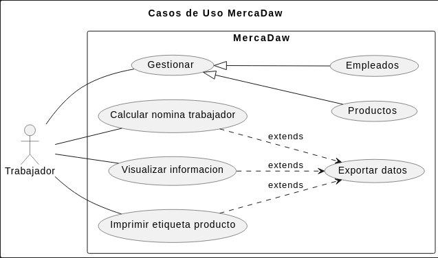
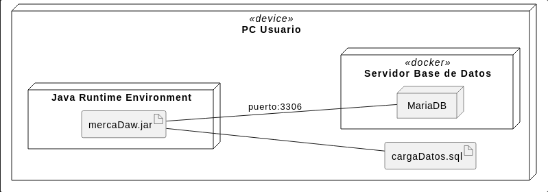
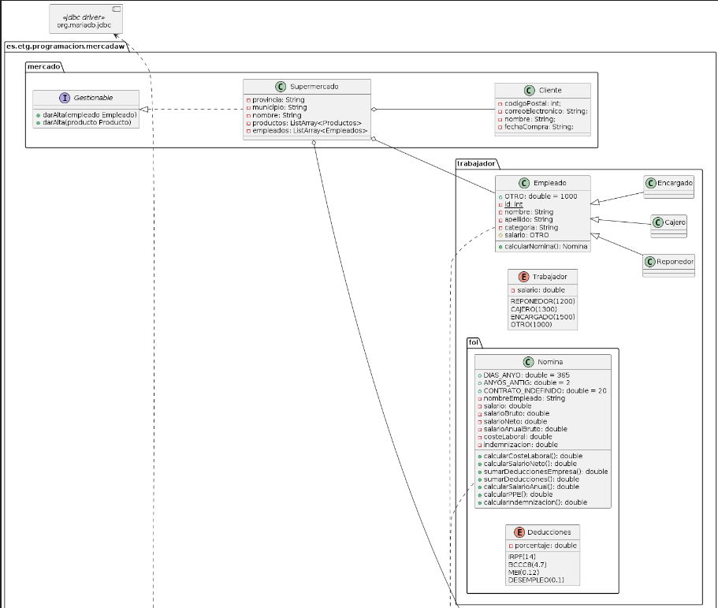
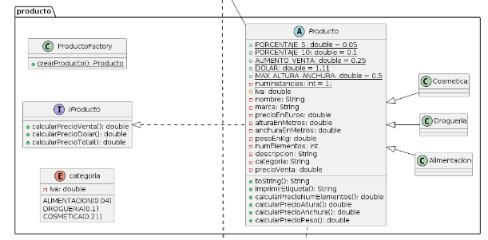
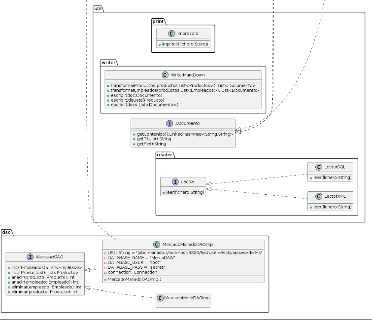

# TRABAJO TERCERA EVALUACION
# REALIZADO POR JORGE ALCALDE, EDDYSON BUENO, ADRIAN NUÑEZ, SERGIO CUMBREÑO, MATEO MAJE

## ENTORNOS DE DESARROLLO
### DIAGRAMA DE CASOS DE USO

Este diagrama ha sido realizado mediante los siguientes requisitos funcionales y no funcionales:

<b>Requisitos funcionales:</b>   
    - Dar de alta producto.  
    - Dar de alta empleados.  
    - Visualizar datos de productos.  
    - Visualizar listado de empleados.  
    - Imprimir etiqueta de un producto.  
    - Calcular nómina de trabajadores.  
    -Exportar datos.   

<b>Requisitos no funcionales:</b>  
    -El sistema se iniciará con la carga de datos desde un fichero a la base de datos(productos y trabajadores).  
    -El alta de productos y empleados se guardará desde java en la base de datos.  
    -El listado de empleados se cargará desde la base de datos a nuestro sistema.  
    -Precio de venta obtenido en euros/dólares.  
    -El cálculo de nóminas generará un fichero con las nóminas de los trabajadores.  
    -La copia de seguridad debe realizarse con un script que copie los datos a un fichero y lo mueva a la carpeta    -"backups".  
    -Los datos exportados pueden pasarse a formato excel, pdf, etc.  

Con todo esto hemos llegado a la solucion correspondiente que se va a usar para el proyecto.

### DIAGRAMA DE COMPONENTES

Este diagrama ha sido efectuado mediante el enunciado aportado, los controladores, interfaces y componentes que van a ser requeridos para su implementacion codificada en java.

### DIAGRAMA DE DESPLIEGUE  

En este diagrama muestra como funciona nuestra carga de datos del proyecto, todo en local y estando conectado a un servidor de base de datos que en este caso es MariaDB atraves del puerto: 3306.
### DIAGRAMA DE CLASES
  
  
  

Este diagrama es el mas largo, y el que mas nos ha costado, pero hemos llegado a su solucion tras mucho trabajo, se compone de las carpetas mercado, trabajador, producto y DAO donde estaran dentro sus diferentes clases, interfaces y enumeraciones, tambien podemos observar arriba del todo que esta conectada a la base de datos MariaDB.  

## SISTEMAS INFORMATICOS
EL SCRIPT SERÁ EXPLICADO EN UNA TAREA QUE NOS HA ABIERTO EVA EN EL AULA VIRTUAL

## PROGRAMACION

Para la codificacion, hemos implementado nuestros diagramas, dividiendo en carpetas partes del codigo (Trabajador, Producto, Mercado, Util, DAO), han habido varios problemas en distintas partes del codigo, sobretodo con compatibilidad, en la forma que se efectuaban los datos, ya que uno ponia la salida de una forma y entraban por otra.

En producto hemos hecho la clase con sus hijas y una enumeracion con cada una de sus categorias, aparte una factoria que los creara. Tambien su interfaz donde calculara los diferentes importes de cada producto.
En empleado tmb hemos creado la clase con su herencia correspondiente y su enumeracion con cada cargo, tambien su factoria para añadir empleados y calculara su correspondientenomina con la interfaz Doumento.
## FOL

Para la parte de FOL hemos creado 2 clases una donde estara la Nomina con los datos de los calculos y el nombre de los empleados y en la otra las Deducciones es decir los porcentajes del FOGASA, IRPF, BCCC, DESEMPLEO Y MEI.

Al hacer los calculos aparecera en la aplicacion el empleado con su correspondiente nomina.
## BASE DE DATOS

La base de datos que hemos utilizado es Mariadb, la cual ha sido docketizada. Hemos creado un script que se encarga de:
- lanzar el docker de mariadb e iniciarlo, el cual crea a su vez la base de datos (MercaDAW).
- insertar datos en la base de datos a través de un fichero (ficheroCargaDatos.sql).
- crear copia de seguridad instalando crontab en el contenedor e iniciar sus servicios, el cual en este caso es obtener los datos de la base de datos y volcarlos en un fichero llamado copiaSeguridad.sql (situado en carpeta "docker" del proyecto). Respecto a la tarea de crontab, se realiza cada 1 minuto.

Los métodos creados respecto a base de datos son de listado productos-empleados, de adición y de eliminación de estos, los cuales han sido probados con Junit (Y DEBUGEADOS UNO A UNO). 
